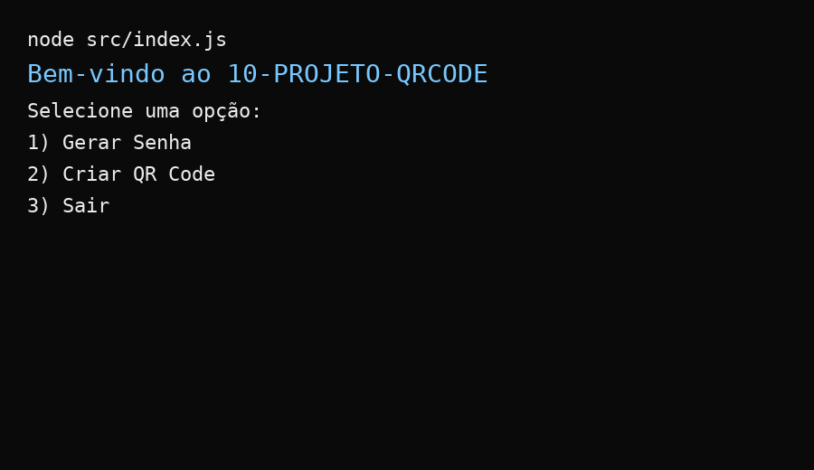
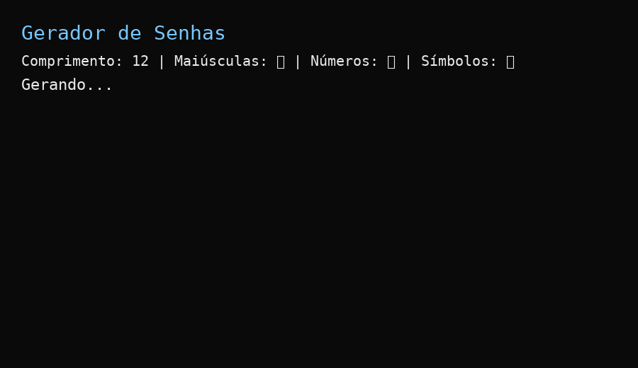
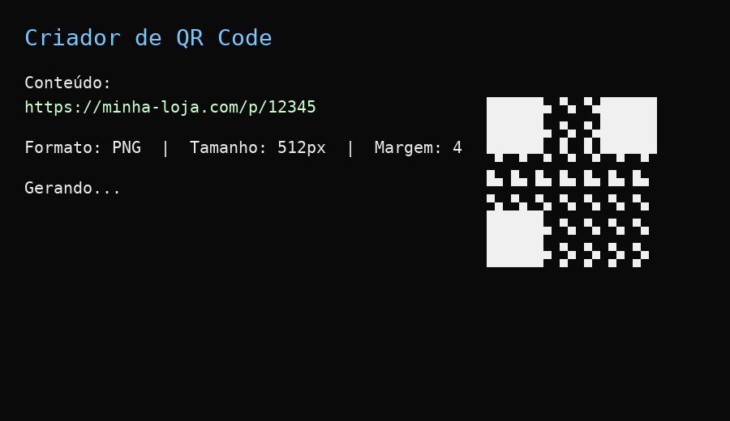

# 🔐 PROJETO-QRCODE e PASSWORD

CLI desenvolvido em **Node.js** para:

- **Gerar senhas seguras** (configuráveis: tamanho, maiúsculas, números e símbolos)  
- **Criar QR Codes** (exportáveis em PNG/SVG, ideais para etiquetas de produtos e e-commerce)  

Projeto pensado como **base para soluções de e-commerce**, permitindo estender para fluxo de pedidos, controle de acessos e muito mais.

---

## 🚀 Demonstração

### Menu principal

### Gerador de senha

### Criador de QR Code

---

## 📂 Arquitetura

10-PROJETO-QRCODE/
├─ node_modules/
├─ src/
│  ├─ prompts/                # Camada de interação (menus/perguntas)
│  │  ├─ prompt-main.js       # Menu principal: escolhe "Senha", "QR Code" ou "Sair"
│  │  └─ prompt-qrcode.js     # Perguntas específicas para criação de QR Code
│  │
│  ├─ services/               # Camada de serviços (lógica de domínio)
│  │  ├─ password/
│  │  │  ├─ create.js         # Geração da senha (usa crypto/algoritmo/validações)
│  │  │  └─ handle.js         # Orquestra fluxo da senha (entrada -> saída/arquivo)
│  │  │
│  │  └─ qr-code/
│  │     ├─ create.js         # Geração de QR Code (chama lib de QR e define opções)
│  │     └─ handle.js         # Orquestra fluxo do QR (entrada -> arquivo .png/.svg)
│  │
│  └─ index.js                # Ponto de entrada da aplicação (orquestra os prompts)
│
├─ .env                       # Variáveis de ambiente (ex.: OUTPUT_DIR, FILE_PREFIX)
├─ .gitignore
├─ package.json
└─ package-lock.json

📝 Licença

Este projeto é distribuído sob a MIT License.
Sinta-se livre para usar, modificar e compartilhar.

